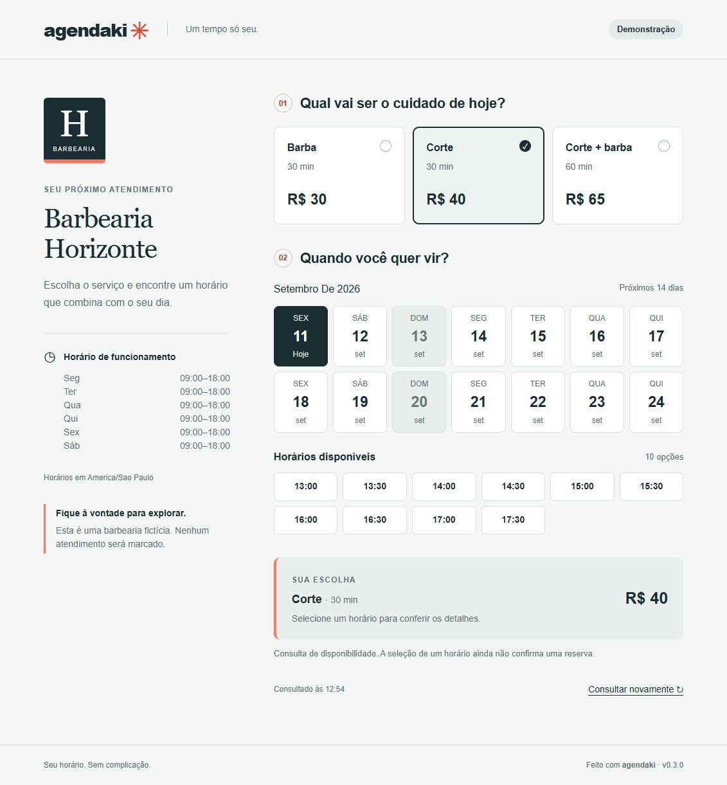

# Agendaki

Consulta de serviços e horários disponíveis para pequenos negócios, com motor de
disponibilidade e proteção contra conflitos no PostgreSQL.

**Versão 0.3.0 · em desenvolvimento.** A página pública permite escolher serviço,
data e horário. A seleção ainda não grava reservas. Login, painel do dono e
cancelamento serão implementados nas próximas etapas. A aplicação roda localmente;
não há uma demonstração online publicada nesta versão.



## Stack

Next.js 15 (App Router), React 19, TypeScript, Tailwind CSS 4, PostgreSQL,
Drizzle ORM, Temporal e Vitest. A infraestrutura planejada é Neon + Vercel.

## Abrir a demonstração local

```sh
pnpm install --frozen-lockfile
pnpm dev:demo
```

Abra **http://127.0.0.1:3100/barbearia-demo**. O comando inicia um PostgreSQL
temporário, aplica as migrações e carrega a barbearia fictícia. Não precisa de
conta Neon, Docker ou `.env`. Ao encerrar com Ctrl+C, os dados temporários são
removidos. Não use esse comando para dados reais. Testado em Windows x64.

Para usar seu próprio PostgreSQL, configure `.env` conforme a seção abaixo e
execute `pnpm dev`. Para compilar: `pnpm build`; para servir a compilação: `pnpm start`.
O TypeScript foi fixado na série 5.9 por compatibilidade com a API usada pelo Next.js 15.

## O que está pronto

- Seis tabelas tipadas no Drizzle, com migrações versionadas.
- Instantes em `timestamptz`, fuso separado e expediente em hora local.
- Restrição no PostgreSQL contra sobreposição de reservas do mesmo negócio.
- Proteção transacional entre reservas e bloqueios, inclusive com concorrência.
- Seed repetível de uma barbearia fictícia com três serviços e seis reservas futuras.
- Testes de integração que iniciam PostgreSQL real local, sem Docker ou Neon.
- Motor puro de disponibilidade com testes de encaixes, virada de dia e horário de verão.
- Página pública em `/[slug]`, com seleção de serviços, calendário de 14 dias e resumo.
- Leitura do banco no servidor, sem expor informações de clientes à página pública.
- Estados de carregamento, erro, negócio inexistente e datas sem disponibilidade.

## Rodar os testes

Requisitos: Node.js 22.12 ou superior e pnpm 11. O lockfile fixa as versões.

```sh
pnpm install --frozen-lockfile
pnpm check
pnpm test
```

Para executar somente os testes do motor, use `pnpm test:agenda`.
Para ver a barbearia oferecendo horários no terminal, use `pnpm demo:horarios`.
Esses dois comandos não precisam de PostgreSQL nem de `.env`.

O teste usa `embedded-postgres` somente em desenvolvimento. Ele inicia um banco
temporário em `127.0.0.1`, escolhe uma porta livre, aplica as migrações, testa e
encerra o servidor. Não lê `DATABASE_URL` e não toca no banco remoto.
Os arquivos temporários ficam em `.test-postgres` ou no diretório indicado por
`TEST_WORK_DIR`. O pacote do PostgreSQL e o esbuild precisam executar os scripts
de instalação permitidos no `pnpm-workspace.yaml`.

## Aplicar no Neon ou PostgreSQL de desenvolvimento

1. Copie `.env.example` para `.env`.
2. Preencha `DATABASE_URL` com a conexão do banco de desenvolvimento. No Neon,
   preserve `sslmode=require` na URL fornecida pelo serviço.
3. Execute `pnpm db:migrate`.
4. Para a demonstração, configure `ALLOW_DEMO_SEED=true` e
   `DEMO_OWNER_PASSWORD` com pelo menos 12 caracteres.
5. Execute `pnpm db:seed`.

O usuário de migração precisa poder criar tabelas, funções e a extensão
`btree_gist`. O ambiente deve manter `READ COMMITTED`, padrão do PostgreSQL.
Não há conexão remota configurada nesta entrega.

Nunca prefixe as variáveis do banco ou de autenticação com `NEXT_PUBLIC_`.
`.env` está ignorado pelo Git. O email fictício do dono é
`dono@barbearia.example`; sua senha vem do ambiente e é armazenada como hash
scrypt com salt aleatório. A integração com Auth.js será feita na etapa do login.

## Como ler o código

| Arquivo | Responsabilidade |
|---|---|
| `src/db/schema.ts` | Tabelas, tipos, chaves e validações declarativas |
| `drizzle/0000_inicial.sql` | Criação das seis tabelas, gerada pelo Drizzle |
| `drizzle/0001_protecao_agenda.sql` | Exclusão de intervalos, proteção entre tabelas e validação de fuso |
| `src/db/client.ts` | Conexão no servidor e associação do schema ao Drizzle |
| `src/db/seed.ts` | Dados fictícios e reposição da demonstração em transação |
| `scripts/migrate.ts` | Aplica migrações pendentes e encerra a conexão |
| `scripts/seed.ts` | Valida a configuração de demo e executa o seed |
| `tests/database.test.ts` | Exercita as garantias no PostgreSQL real |
| `src/agenda/horarios-livres.ts` | Calcula disponibilidade com dados recebidos, sem banco/rede/relógio global |
| `tests/horarios-livres.test.ts` | Casos esperados de disponibilidade, fuso e entradas inválidas |
| `scripts/demo-horarios.ts` | Exemplo reproduzível da agenda no terminal |
| `src/agenda/pagina-publica.ts` | Consulta pública consistente, incluindo ocupações que atravessam a janela |
| `app/[slug]/page.tsx` | Rota pública renderizada no servidor |
| `app/components/agenda-publica.tsx` | Seleção de serviço, data e horário |
| `scripts/preview-demo.ts` | Demonstração local com banco temporário |

## Decisões e limites

**Datas.** Reservas e bloqueios são instantes com início e fim. Expediente é uma
regra local por dia da semana, com `termina_dia_seguinte` para horários como
22h–02h. Os intervalos têm início inclusivo e fim exclusivo: 9h–10h permite um
novo atendimento às 10h. A geração de encaixes usa Temporal com o polyfill
`@js-temporal/polyfill`, sem depender do fuso configurado no computador.

## Contrato do motor

`calcularHorariosLivres(entrada)` recebe fuso IANA, data inicial local,
quantidade de dias (1–14), duração do serviço e passo da grade (minutos inteiros
de 1–1440), expediente semanal, bloqueios, agendamentos ocupados e `agoraUTC`.
Devolve intervalos `{ inicio, fim }` em ISO UTC com `Z`, ordenados e sem duplicatas.
Entradas não são modificadas; entradas inválidas geram `RangeError`.

- O passo é ancorado na abertura. Um bloqueio de 9h10–9h40 não cria um novo
  início às 9h40 numa grade de meia em meia hora.
- O serviço precisa caber inteiro no expediente e não pode tocar o interior
  de nenhuma ocupação. Terminar exatamente no começo de um bloqueio é permitido.
- Faixas de funcionamento sobrepostas ou adjacentes são unidas. A grade fica
  ancorada na primeira abertura desse período contínuo.
- A janela filtra a **data local do início**. Uma reserva pode terminar no dia
  seguinte. A consulta inclui a madrugada de um expediente iniciado ontem.
- Horários anteriores a `agoraUTC` são excluídos. Um início igual a agora cabe;
  a antecedência mínima não faz parte deste MVP.
- Duração e passo representam minutos reais. No avanço do horário de verão,
  não aparecem horas inexistentes. No retorno, as duas ocorrências de uma hora
  são instantes UTC diferentes; a futura tela deve distingui-las pelo offset.
- Se a própria abertura ou fechamento for ambígua/inexistente, a função rejeita
  a configuração com erro, em vez de escolher um instante silenciosamente.
- O chamador deve filtrar reservas canceladas e fornecer todas as ocupações
  que **intersectam** os expedientes consultados, incluindo as iniciadas antes
  da janela ou terminadas depois dela. Uma consulta só por data de início perde
  conflitos. O adaptador `obterPaginaPublica` já faz essa consulta por interseção.
- O resultado não garante uma reserva: o fluxo de gravação deve recalcular e
  manter a proteção transacional no PostgreSQL.

Exemplo: 9h–18h, serviço e passo de 30 minutos, almoço 12h–13h e reservas
10h–10h30 e 15h–16h produzem 13 encaixes. `pnpm demo:horarios` mostra cada um
em horário local e UTC.

Referência da política de conversão: [documentação do Temporal sobre fusos e
ambiguidades](https://github.com/tc39/proposal-temporal/blob/main/docs/timezone.md).

## Garantias do banco e demonstração

**Concorrência.** `UNIQUE(negocio_id, inicio)` não impediria 9h–10h contra
9h30–10h30. Por isso a migração cria uma exclusão GiST sobre o intervalo inteiro.
Reservas canceladas deixam de ocupar a agenda; atendidas e faltas preservam o
histórico ocupado. Antes de alterar uma reserva ou bloqueio, o trigger atualiza
`negocio.agenda_revisao`. Essa escrita ordena operações concorrentes do mesmo
negócio. Depois ele consulta a outra tabela e recusa conflitos. A revisão é
metadado interno, não uma funcionalidade nova.

Uma exclusão entre reservas sozinha não protegeria um bloqueio criado na outra
tabela. Os testes mantêm a primeira transação aberta e verificam no PostgreSQL
que a segunda está aguardando o lock; após o commit, ela deve falhar.

Em `REPEATABLE READ` ou `SERIALIZABLE`, a disputa pode resultar em `40001`.
Ao implementar a API, será necessário repetir a transação completa em falhas de
serialização/deadlock e traduzir `23P01` em conflito de horário. A suíte atual
exercita o nível padrão `READ COMMITTED`.

**Integridade.** O serviço deve pertencer ao negócio da reserva, por chave
estrangeira composta. Preços são centavos inteiros. Fuso é validado contra o
catálogo do PostgreSQL. Registros de agenda não podem ser transferidos entre
negócios. Editar um serviço não altera a duração de reservas já gravadas.

**Migrações.** Use `pnpm db:generate` para alterações declarativas futuras e
migrações customizadas para triggers/exclusão. Não use `drizzle-kit push`: as
garantias SQL customizadas não estão integralmente representadas no schema TS.
Não edite uma migração já aplicada em um banco compartilhado.

**Demonstração.** `demonstracao=true` identifica o negócio fictício. O seed
recria somente os dados desse negócio, dentro de uma transação; outros negócios
são preservados. Os agendamentos ficam nos próximos três dias de funcionamento,
a partir de amanhã, com almoço bloqueado e três serviços (R$ 40, R$ 30 e R$ 65).
Reexecutar renova os dados, os códigos de cancelamento e a senha da demo.
Telefones são placeholders inválidos e o domínio de email é `.example`.
Quando a interface existir, ações de WhatsApp na demo deverão apenas exibir a
mensagem, sem envio. O seed não faz chamadas externas nem envia mensagens.

O banco guarda SHA-256 de tokens aleatórios de cancelamento com 256 bits de
entropia. O seed imprime os links relativos para revisão; a rota ainda não existe.

## Validação desta etapa

60 testes: 43 do motor e 17 de integração com PostgreSQL real.
O motor cobre resultados exatos, bloqueios parciais, precisão de microssegundos,
grade, passado, janela de 14 dias, madrugada, faixas unidas, horário de verão,
fuso com offset fracionário, imutabilidade e rejeição de entradas inválidas.
O exemplo de terminal devolve os 13 encaixes esperados.

15 testes de integração cobrem migrações repetidas, sobreposição parcial,
adjacência, cancelamento/reativação, isolamento entre negócios, serviço inválido,
duração/preço, fuso/expediente, UTC, bloqueios, três disputas simultâneas e seed
repetido. O teste de UTC normaliza a representação textual retornada pelo driver
antes de comparar o instante.

Os dois testes adicionais do adaptador público verificam privacidade, isolamento
entre negócios, ocupações anteriores à janela, reservas canceladas, serviços
inativos, negócio vazio e slug inexistente. A limpeza do PostgreSQL temporário
tem repetição limitada para lidar com arquivos que o Windows ainda está liberando.

O indicador de desenvolvimento do Next.js está desativado. Não há cursor
personalizado na página. Em navegadores compatíveis, ferramentas WebMCP permitem
consultar disponibilidade e selecionar um horário; nenhuma delas confirma reservas.

## Próximas etapas do escopo aprovado

1. Gravação de reservas com revalidação da disponibilidade e tratamento de conflitos.
2. Login e painel do dono; bloqueios e cancelamento pelo cliente.
3. Publicação na Vercel com Neon, após configuração das contas.

Funcionalidades fora do MVP estão registradas em `V2.md`.
